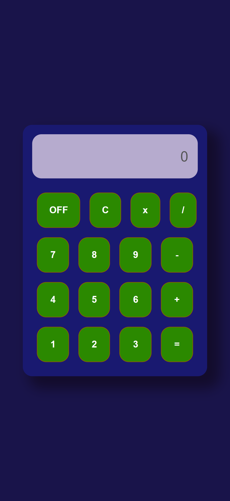

# Calculadora

  

 ---

### [ _1º Desafio da Formação React Developer_](https://web.dio.me/track/formacao-react-developer)

Este desafio foi feito para por em prática tuco que foi ensinado na formação React Developer da Dio. Onde após acompanhar o inicio do código com o professor ficou para terminamos a implementação das operações de *Multiplicar* e *Dividir*. 

